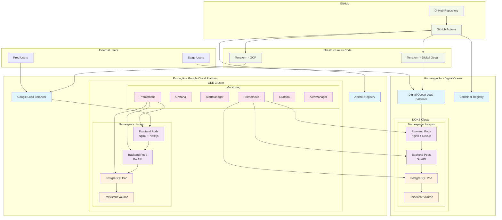
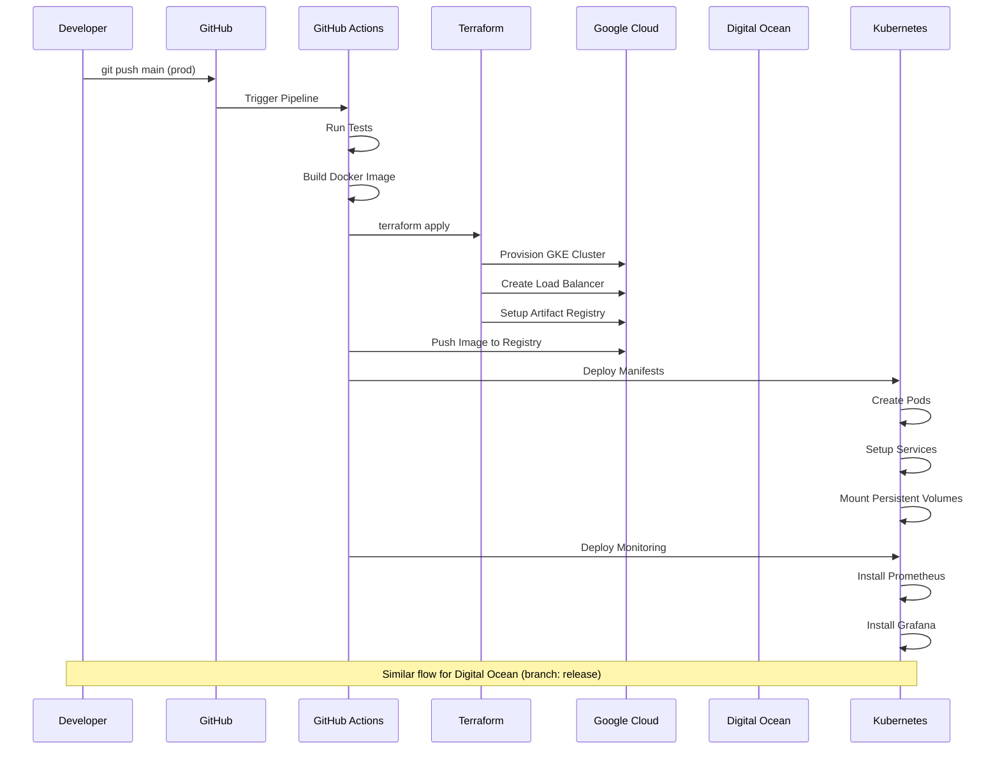
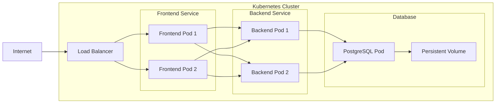
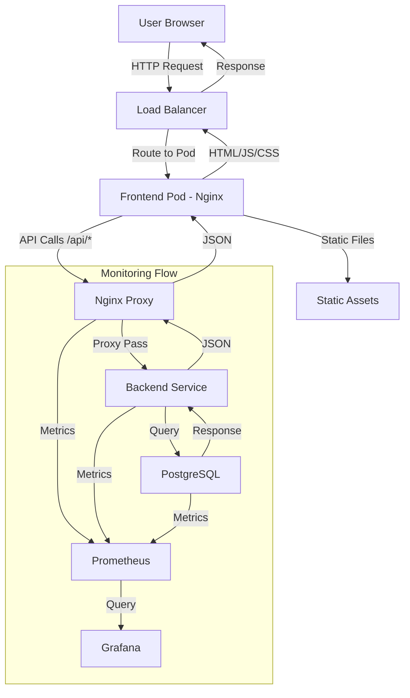
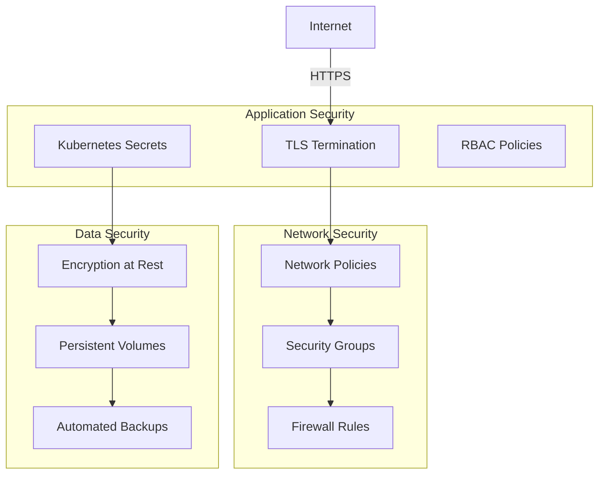

# Diagrama de Arquitetura - ListaPro Multi-Cloud

## 🏗️ Arquitetura Multi-Cloud

## 🌊 Fluxo de Deploy

## 🔄 Arquitetura de Rede Interna

## 📊 Fluxo de Dados

## 🛡️ Segurança e Isolamento

---

## 📋 Legenda

| Componente | Descrição | Tecnologia |
|------------|-----------|------------|
| **Frontend** | Interface do usuário | Next.js 15 + TypeScript |
| **Proxy** | Roteamento e CORS | Nginx |
| **Backend** | API REST | Go + Gin Framework |
| **Database** | Armazenamento de dados | PostgreSQL 17 |
| **Monitoring** | Observabilidade | Prometheus + Grafana |
| **CI/CD** | Automação | GitHub Actions |
| **IaC** | Infraestrutura | Terraform |
| **Orquestração** | Container management | Kubernetes |
