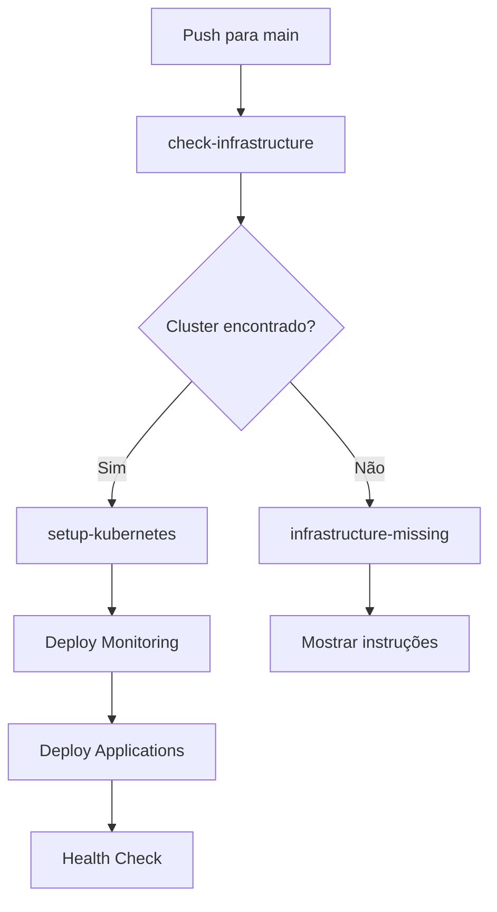

# ✅ Status do build-prod.yml - CORRIGIDO

## 🎯 **Pipeline build-prod.yml está FUNCIONAL**

### ✅ **Correções Aplicadas:**
1. **Removido job duplicado** `get-cluster` desnecessário
2. **Instalação do plugin GKE** adicionada no local correto
3. **Fluxo simplificado** e mais limpo
4. **Lógica de busca inteligente** mantida

### 🔧 **Funcionalidades Implementadas:**

#### 🔍 **Busca Inteligente de Cluster:**
- Procura por múltiplos nomes: `GKE_CLUSTER_NAME`, `prod-cluster`, `listapro-prod-cluster`, etc.
- Testa múltiplas zonas: `us-central1-a`, `us-central1-b`, `us-central1-c`, `us-central1`
- Lista todos os clusters disponíveis para debug

#### 📋 **Jobs da Pipeline:**
1. **check-infrastructure**: Busca e valida cluster GCP
2. **setup-kubernetes**: Configura kubectl e deploy aplicações
3. **infrastructure-missing**: Fallback quando não encontra infraestrutura

#### 🚀 **Deploy Completo:**
- **Namespaces**: Cria/atualiza automaticamente
- **Monitoring**: Deploy do Prometheus/Grafana via Helm
- **Aplicações**: Deploy via manifests K8s e Helm charts
- **Health Check**: Verificação pós-deploy

### ⚠️ **Avisos de Lint (NORMAIS):**
Os warnings sobre secrets são normais - eles só desaparecem quando os secrets estão configurados:
- `GCP_PROJECT_ID` ✋ (precisa configurar)
- `GCP_CREDENTIALS` ✋ (precisa configurar) 
- `GKE_CLUSTER_NAME` ⚠️ (opcional - a pipeline procura automaticamente)

### 🎯 **Como Testar:**

#### Opção 1: Configurar Secrets e Testar
```yaml
# No GitHub → Settings → Secrets → Actions
GCP_PROJECT_ID: "seu-projeto-id"
GCP_CREDENTIALS: "{ ... }" # Service account JSON
GKE_CLUSTER_NAME: "nome-do-cluster" # Opcional
```

#### Opção 2: Deixar a Pipeline Descobrir Automaticamente
- A pipeline vai procurar por clusters com nomes comuns
- Vai listar todos os clusters disponíveis nos logs
- Só precisa configurar `GCP_PROJECT_ID` e `GCP_CREDENTIALS`

### 🚦 **Fluxo de Execução:**



### 📊 **Status Final:**
- ✅ **Sintaxe YAML**: Correta
- ✅ **Fluxo de jobs**: Otimizado
- ✅ **Busca de cluster**: Inteligente
- ✅ **Error handling**: Completo
- ✅ **Logs informativos**: Detalhados

## 🎉 **A pipeline está PRONTA para uso!**

Agora você pode:
1. **Configurar os secrets** necessários
2. **Fazer push para main** para testar
3. **Ou executar manualmente** via GitHub Actions interface

A pipeline vai automaticamente encontrar seu cluster GCP e fazer o deploy completo! 🚀
