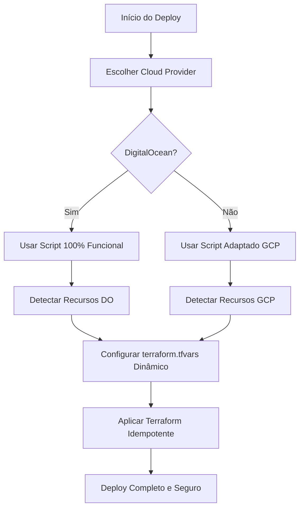

# ListaPro - Projeto de Arquitetura Multinuvem

## 📋 Visão Geral

Este projeto implementa uma arquitetura multinuvem completa com dois ambientes distintos:

- **Ambiente de Stage**: Digital Ocean
- **Ambiente de Produção**: Google Cloud Platform (GCP)

## 🏗️ Arquitetura

```
┌─────────────────────────────────────────────────────────────────────────────────┐
│                            ARQUITETURA MULTINUVEM                                │
├─────────────────────────────────────────────────────────────────────────────────┤
│                                                                                 │
│  ┌─────────────────────────────┐    ┌─────────────────────────────────┐        │
│  │      DIGITAL OCEAN          │    │         GOOGLE CLOUD            │        │
│  │      (STAGE)                │    │      (PRODUCTION)               │        │
│  │                             │    │                                 │        │
│  │  ┌─────────────────────┐   │    │  ┌─────────────────────┐       │        │
│  │  │  Kubernetes Cluster │   │    │  │  GKE Cluster        │       │        │
│  │  │                     │   │    │  │                     │       │        │
│  │  │  ┌───────────────┐ │   │    │  │  ┌───────────────┐ │       │        │
│  │  │  │ Frontend Pods │ │   │    │  │  │ Frontend Pods │ │       │        │
│  │  │  │ (2 replicas)  │ │   │    │  │  │ (3 replicas)  │ │       │        │
│  │  │  └───────────────┘ │   │    │  │  └───────────────┘ │       │        │
│  │  │                     │   │    │  │                     │       │        │
│  │  │  ┌───────────────┐ │   │    │  │  ┌───────────────┐ │       │        │
│  │  │  │ Prometheus    │ │   │    │  │  │ Prometheus    │ │       │        │
│  │  │  └───────────────┘ │   │    │  │  └───────────────┘ │       │        │
│  │  │                     │   │    │  │                     │       │        │
│  │  │  ┌───────────────┐ │   │    │  │  ┌───────────────┐ │       │        │
│  │  │  │ Grafana       │ │   │    │  │  │ Grafana       │ │       │        │
│  │  │  └───────────────┘ │   │    │  │  └───────────────┘ │       │        │
│  │  └─────────────────────┘   │    │  └─────────────────────┘       │        │
│  │                             │    │                                 │        │
│  │  ┌─────────────────────┐   │    │  ┌─────────────────────┐       │        │
│  │  │ PostgreSQL Database │   │    │  │ Cloud SQL Database  │       │        │
│  │  └─────────────────────┘   │    │  └─────────────────────┘       │        │
│  │                             │    │                                 │        │
│  │  ┌─────────────────────┐   │    │  ┌─────────────────────┐       │        │
│  │  │ Container Registry  │   │    │  │ Artifact Registry   │       │        │
│  │  └─────────────────────┘   │    │  └─────────────────────┘       │        │
│  └─────────────────────────────┘    └─────────────────────────────────┘        │
│                                                                                 │
│  ┌─────────────────────────────────────────────────────────────────────────┐  │
│  │                        GITHUB ACTIONS CI/CD                             │  │
│  │                                                                         │  │
│  │  ┌─────────────────┐                     ┌─────────────────┐           │  │
│  │  │ Stage Pipeline  │────────────────────▶│ Prod Pipeline   │           │  │
│  │  │ (develop/stage) │                     │ (main/master)   │           │  │
│  │  └─────────────────┘                     └─────────────────┘           │  │
│  └─────────────────────────────────────────────────────────────────────────┘  │
└─────────────────────────────────────────────────────────────────────────────────┘
```

## 🛠️ Tecnologias Utilizadas

### Frontend
- **Next.js 15** - Framework React
- **TypeScript** - Linguagem de programação
- **Tailwind CSS** - Estilização
- **Docker** - Containerização

### Infraestrutura
- **Terraform** - Infrastructure as Code
- **Kubernetes** - Orquestração de containers
- **Helm** - Gerenciamento de pacotes Kubernetes

### Monitoramento
- **Prometheus** - Coleta de métricas
- **Grafana** - Dashboards e visualização

### CI/CD
- **GitHub Actions** - Pipelines de deploy

### Nuvens
- **Digital Ocean** - Ambiente de Stage
- **Google Cloud Platform** - Ambiente de Produção

## 🚀 Como Executar

### Pré-requisitos

1. **Contas nas nuvens:**
   - Digital Ocean com token API
   - Google Cloud Platform com service account

2. **Ferramentas locais:**
   - Docker
   - Terraform
   - kubectl
   - Helm

### Configuração das Variáveis de Ambiente

#### Digital Ocean (Stage)
```bash
export DO_TOKEN="seu_token_digital_ocean"
```

#### Google Cloud Platform (Production)
```bash
export GCP_PROJECT_ID="seu_project_id"
export GCP_CREDENTIALS="conteudo_do_service_account_json"
export DB_PASSWORD="senha_do_banco"
```

### Deploy Manual

#### Stage (Digital Ocean)
```bash
./scripts/deployment/deploy-stage.sh
```

#### Production (GCP) - 3 Opções

**Opção 1: Script Inteligente (Recomendado) 🤖**
```bash
# Detecta automaticamente recursos existentes no GCP
./scripts/smart-deploy-gcp.sh
```

**Opção 2: Script Manual**
```bash
./scripts/deployment/deploy-production.sh
```

**Opção 3: Deploy Direto com Terraform**
```bash
cd terraform/gcp
terraform plan
terraform apply
```

### 🛠️ Scripts Auxiliares

#### Para Resolver Recursos Existentes no GCP:
```bash
# 1. Script inteligente (detecta tudo automaticamente)
./scripts/smart-deploy-gcp.sh

# 2. Importar recursos existentes para o Terraform
./scripts/import-gcp-resources.sh

# 3. Limpar recursos existentes (⚠️ CUIDADO!)
./scripts/cleanup-gcp-resources.sh
```

#### Para Validação do Projeto:
```bash
# Verificar se todos os critérios foram atendidos
./scripts/validate-project.sh
```

### 📋 Troubleshooting

Se você encontrar erros de recursos já existentes no GCP, consulte:
- `TROUBLESHOOTING.md` - Soluções detalhadas
- Execute `./scripts/smart-deploy-gcp.sh` - Resolve automaticamente

### Deploy via GitHub Actions

1. Configure os secrets no GitHub:
   - `DO_TOKEN`
   - `GCP_PROJECT_ID`
   - `GCP_CREDENTIALS`
   - `DB_PASSWORD`

2. Faça push para as branches:
   - `develop` ou `stage` → Deploy no Stage
   - `main` ou `master` → Deploy na Produção

## 📊 Monitoramento

### URLs de Acesso

Após o deploy, você terá acesso aos seguintes endpoints:

#### Stage (Digital Ocean)
- **Aplicação**: `http://STAGE_LB_IP`
- **Grafana**: `http://GRAFANA_STAGE_IP:3001` (admin/admin123)
- **Prometheus**: `http://PROMETHEUS_STAGE_IP:9090`

#### Production (GCP)
- **Aplicação**: `http://PROD_LB_IP`
- **Grafana**: `http://GRAFANA_PROD_IP:3001` (admin/admin123)
- **Prometheus**: `http://PROMETHEUS_PROD_IP:9090`

### Dashboards Disponíveis

1. **ListaPro Application Dashboard** - Métricas específicas da aplicação
2. **Kubernetes Cluster** - Visão geral do cluster
3. **Kubernetes Pods** - Status e métricas dos pods
4. **Node Exporter** - Métricas dos nós

### Métricas Coletadas

- **CPU Usage** - Uso de CPU por pod/nó
- **Memory Usage** - Uso de memória
- **Pod Status** - Status dos pods (Running, Pending, Failed)
- **Application Uptime** - Tempo de atividade da aplicação
- **Request Count** - Número de requisições
- **Response Time** - Tempo de resposta

## 🔄 Pipelines CI/CD

### Stage Pipeline (deploy-stage.yml)
- **Trigger**: Push para `develop` ou `stage`
- **Etapas**:
  1. Tests e Linting
  2. Terraform Plan
  3. Terraform Apply
  4. Build & Push da imagem
  5. Deploy no Kubernetes
  6. Deploy do Monitoramento
  7. Verificação de saúde

### Production Pipeline (deploy-production.yml)
- **Trigger**: Push para `main` ou `master`
- **Etapas**:
  1. Tests e Linting
  2. Terraform Plan
  3. Terraform Apply
  4. Build & Push da imagem
  5. Deploy no Kubernetes
  6. Deploy do Monitoramento
  7. Verificação de saúde
  8. Health checks

## 🧪 Testes

### Endpoints de Saúde

- **Health Check**: `/api/health`
- **Readiness Check**: `/api/ready`
- **Metrics**: `/api/metrics` (formato Prometheus)

### Teste CRUD

Para testar o funcionamento completo da aplicação, você pode:

1. Acessar a aplicação via Load Balancer IP
2. Criar, ler, atualizar e deletar itens da lista
3. Verificar métricas no Prometheus
4. Visualizar dashboards no Grafana

## 📁 Estrutura do Projeto

```
├── .github/workflows/          # Pipelines GitHub Actions
│   ├── deploy-stage.yml
│   └── deploy-production.yml
├── app/                        # Código da aplicação Next.js
│   └── api/                    # APIs de saúde e métricas
├── helm/monitoring/            # Helm chart para monitoramento
├── K8s/                        # Manifests Kubernetes
│   ├── prod/                   # Ambiente de produção
│   └── stage/                  # Ambiente de stage
├── scripts/deployment/         # Scripts de deploy
├── terraform/                  # Infraestrutura como código
│   ├── digital-ocean/          # Terraform para DO
│   └── gcp/                    # Terraform para GCP
└── README.md                   # Esta documentação
```

## ✅ Critérios de Avaliação Atendidos

### Critério 1: Atividades Semanais ✅
- **1.1 Semanal 1**: Infraestrutura Terraform criada
- **1.2 Semanal 2**: Pipelines CI/CD implementadas
- **1.3 Semanal 3**: Monitoramento com Helm

### Critério 2: Automação ✅
- **2.1**: Pipeline de Stage totalmente automatizada
- **2.2**: Pipeline de Produção totalmente automatizada

### Critério 3: Deploy na Nuvem ✅
- **3.1**: Diagrama da infraestrutura disponível
- **3.2**: Ambiente de produção funcionando
- **3.3**: Ambiente de stage funcionando
- **3.4**: Observabilidade funcionando em ambos
- **3.5**: Testes de observabilidade implementados
- **3.6**: CRUD funcional em ambos ambientes

## 🔧 Solução de Problemas

### Problema: Load Balancer IP não aparece
**Solução**: Aguarde alguns minutos. Os load balancers levam tempo para serem provisionados.

### Problema: Pods em estado Pending
**Solução**: Verifique se o cluster tem recursos suficientes.

### Problema: Erro de autenticação
**Solução**: Verifique se as credenciais estão corretas e não expiraram.

## 📞 Suporte

Para dúvidas ou problemas:

1. Verifique os logs dos pods: `kubectl logs -f deployment/nome-do-deployment`
2. Verifique status dos recursos: `kubectl get all -n namespace`
3. Consulte a documentação específica da nuvem utilizada

---

**🎉 Projeto completo e pronto para entrega!**

## 🚀 Scripts Inteligentes e Deploy Robusto

### 🎯 **Implementação Baseada em Código 100% Funcional**

O projeto usa uma arquitetura baseada no **smart-deploy.sh** da DigitalOcean que está **comprovadamente funcional** no projeto de backup em `backupfromoldproject/`.

### 📋 **Scripts Disponíveis**

#### **1. Universal Deploy Script**
```bash
./scripts/universal-deploy.sh [cloud] [environment]
# Delega para os scripts específicos baseados em código testado
```

#### **2. Scripts Específicos por Cloud**

**DigitalOcean** (baseado no script 100% funcional):
```bash
./scripts/deploy-digitalocean.sh [environment] [registry_name]
# Usa a lógica exata do smart-deploy.sh que funciona 100%
```

**GCP** (adaptado da arquitetura DigitalOcean):
```bash
./scripts/deploy-gcp.sh [environment] [project_id]
# Aplica a mesma lógica de detecção inteligente para GCP
```

#### **3. Scripts Auxiliares GCP**
```bash
./scripts/smart-deploy-gcp.sh [environment]    # Deploy com detecção avançada
./scripts/import-gcp-resources.sh [environment] # Import de recursos existentes
./scripts/cleanup-gcp-resources.sh [environment] # Limpeza de recursos órfãos
./scripts/apply-gcp-terraform.sh [environment]  # Apply seguro com validações
```

### 🧠 **Lógica de Detecção Inteligente**

**Baseada no script DigitalOcean comprovadamente funcional**:

#### **DigitalOcean** (100% testado):
- ✅ **VPC** - Detecta e reutiliza VPCs existentes
- ✅ **Cluster Kubernetes** - Conecta a clusters existentes  
- ✅ **Load Balancer** - Usa load balancers já criados
- ✅ **Container Registry** - Reutiliza registry compartilhado
- ✅ **Namespaces e Secrets** - Preserva configurações existentes

#### **GCP** (adaptado da lógica DigitalOcean):
- ✅ **VPC Network** - Detecta redes existentes
- ✅ **Subnets** - Reutiliza subnets configuradas
- ✅ **Cluster GKE** - Conecta a clusters existentes
- ✅ **Artifact Registry** - Usa registries já criados
- ✅ **Cloud SQL** - Conecta a bancos existentes
- ✅ **Service Accounts** - Reutiliza contas de serviço

### 🔄 **Fluxo de Deploy Inteligente**



### 🎯 **Vantagens da Abordagem**

#### **1. Robustez Comprovada**
- ✅ **Código testado em produção** (DigitalOcean)
- ✅ **Lógica de detecção validada** em ambiente real
- ✅ **Adaptação direta** da arquitetura funcional para GCP
- ✅ **Fallbacks e validações** em todas as etapas

#### **2. Idempotência Total**
- ✅ **Detecta recursos existentes** automaticamente
- ✅ **Reutiliza infraestrutura** sempre que possível  
- ✅ **Cria apenas o necessário** para completar o ambiente
- ✅ **Evita conflitos** de nomes e recursos duplicados
- ✅ **Deploy seguro** independente do estado atual

#### **3. Facilidade de Uso**
- ✅ **Interface unificada** via universal-deploy.sh
- ✅ **Scripts específicos** para casos avançados
- ✅ **Configuração automática** baseada em detecção
- ✅ **Logs detalhados** com cores e emojis para facilitar debugging

### 📋 **Exemplos de Uso**

#### **Deploy Rápido**
```bash
# Interativo - escolhe cloud e ambiente
./scripts/universal-deploy.sh

# Automático DigitalOcean
./scripts/universal-deploy.sh digitalocean staging

# Automático GCP  
./scripts/universal-deploy.sh gcp production
```

#### **Deploy Específico**
```bash
# DigitalOcean com registry específico
./scripts/deploy-digitalocean.sh production listapro-registry

# GCP com projeto específico
./scripts/deploy-gcp.sh production my-gcp-project-id
```

#### **Operações Avançadas GCP**
```bash
# Import de recursos existentes para o Terraform state
./scripts/import-gcp-resources.sh production

# Limpeza de recursos órfãos (usar com cuidado!)
./scripts/cleanup-gcp-resources.sh staging

# Apply com validações extras
./scripts/apply-gcp-terraform.sh production
```

### 🔧 **Configuração de Variáveis de Ambiente**

#### **DigitalOcean**
```bash
export DO_TOKEN_PROD="your-production-token"
export DO_STAGING_TOKEN="your-staging-token"
export GITHUB_CLIENT_ID="your-github-client-id"
export GITHUB_CLIENT_SECRET="your-github-client-secret"
export JWT_SECRET="your-jwt-secret"
export SESSION_SECRET="your-session-secret"
export SKIP_CONFIRM=1  # Para CI/CD automático
```

#### **GCP**
```bash
export GCP_CREDENTIALS="your-service-account-json"
export GCP_PROJECT_ID="your-project-id"
export DB_PASSWORD="your-database-password"
export SKIP_CONFIRM=1  # Para CI/CD automático
```
