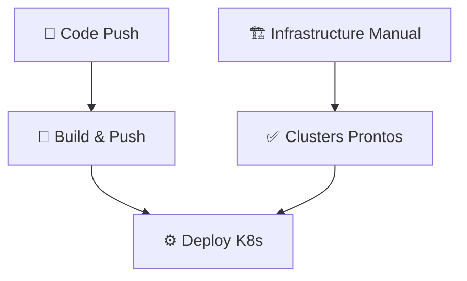

# 🎯 Estrutura Simplificada de Pipelines - ListaPro

## 📋 Nova Estrutura (3 Pipelines)

### 🏗️ 1. Infrastructure (Manual)
**Arquivo:** `.github/workflows/infrastructure.yml`
- **Quando:** Manual via GitHub Actions
- **O que faz:** Deploy da infraestrutura (Terraform)
- **Controles:** Cloud (GCP/DigitalOcean) + Environment + Action (plan/apply/destroy)

### 🚀 2. Build & Push (Automática) 
**Arquivo:** `.github/workflows/build-push.yml`
- **Quando:** Push para main/master ou manual
- **O que faz:** Build Docker images e push para registries
- **Clouds:** GCP e DigitalOcean simultaneamente

### ⚙️ 3. Deploy Kubernetes (Automática)
**Arquivo:** `.github/workflows/deploy-k8s.yml`
- **Quando:** Após build ou manual
- **O que faz:** Deploy no Kubernetes (usa images já buildadas)
- **Environments:** Production e Staging para ambas as clouds

## 🔄 Fluxo de Trabalho



### 1️⃣ **Primeira vez (Setup inicial):**
```bash
# 1. Deploy infraestrutura manualmente
GitHub Actions → Infrastructure → Run workflow
- Cloud: gcp
- Environment: production  
- Action: plan (depois apply)

# 2. Push código (automático)
git push origin main
```

### 2️⃣ **Desenvolvimento contínuo:**
```bash
# Apenas push código - resto é automático
git push origin main

# Build & Push → Deploy K8s (automático)
```

### 3️⃣ **Deploy manual específico:**
```bash
# GitHub Actions → Deploy Kubernetes → Run workflow
- Cloud: gcp
- Environment: staging
- Image tag: latest
```

## 📁 Estrutura de Arquivos

```
.github/workflows/
├── infrastructure.yml          # 🏗️ Manual (Terraform)
├── build-push.yml             # 🚀 Auto (Docker build)
└── deploy-k8s.yml             # ⚙️ Auto (K8s deploy)

scripts/
├── universal-deploy.sh         # Script para infra manual
├── smart-deploy-gcp.sh         # GCP específico
└── smart-deploy-do.sh          # DigitalOcean específico
```

## ✅ Vantagens da Nova Estrutura

1. **🎯 Simples:** Apenas 3 pipelines essenciais
2. **🔧 Separação clara:** Infra manual, build/deploy automático
3. **⚡ Eficiente:** Build uma vez, deploy em múltiplas clouds
4. **🛡️ Seguro:** Infraestrutura controlada, apps automáticos
5. **🔄 Flexível:** Pode escolher cloud/environment específicos

## 🚀 Como Usar

### Para Infraestrutura:
1. Ir para **GitHub Actions**
2. Selecionar **🏗️ Infrastructure**
3. Clicar **Run workflow**
4. Escolher parâmetros e executar

### Para Aplicação:
```bash
# Automático - apenas push
git add .
git commit -m "feat: nova feature"
git push origin main

# Build → Push → Deploy (tudo automático)
```

### Para Deploy Manual:
1. Ir para **GitHub Actions**
2. Selecionar **⚙️ Deploy to Kubernetes**
3. Escolher cloud + environment
4. Executar

## 📋 Secrets Necessários

### GCP:
- `GCP_CREDENTIALS` - Service account JSON
- `GCP_PROJECT_ID` - Project ID
- `DB_PASSWORD` - Database password

### DigitalOcean:
- `DO_TOKEN_PROD` - API token
- `GITHUB_CLIENT_ID` - OAuth app
- `GITHUB_CLIENT_SECRET` - OAuth secret
- `JWT_SECRET` - JWT secret
- `SESSION_SECRET` - Session secret
- `DATABASE_URL` - Database URL
- `DB_HOST` - Database host
- `DB_USER` - Database user
- `DB_PASSWORD` - Database password

## 🎉 Resultado Final

✅ **3 pipelines apenas** (vs 8+ anteriores)
✅ **Infraestrutura manual** (sem recriação acidental)
✅ **Build/Deploy automático** (desenvolvimento ágil)
✅ **Multi-cloud** (GCP + DigitalOcean)
✅ **Multi-environment** (Production + Staging)
✅ **Flexibilidade total** (manual quando necessário)
