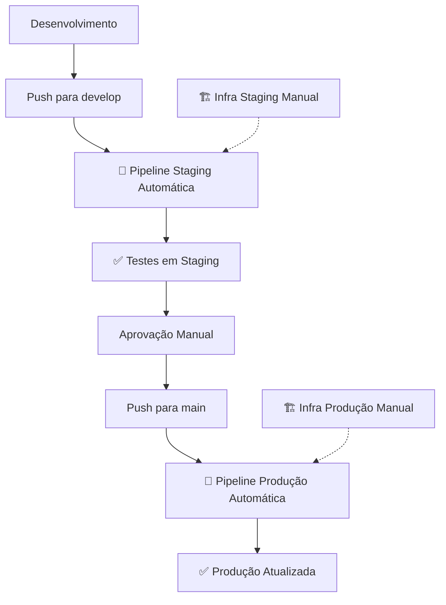

# 🎯 Status Final das Pipelines - ListaPro

## ✅ Pipelines Completadas e Funcionais

### 🏗️ Infraestrutura (Manual)

#### ✅ **Produção GCP** - `infra-prod.yml`
- ✋ Manual com confirmação obrigatória
- 🛡️ Robusto e idempotente
- 🎯 Ações: plan, apply, destroy
- 🌍 Cloud: Google Cloud Platform
- 📂 Script: `scripts/smart-deploy-gcp.sh`

#### ✅ **Staging Digital Ocean** - `infra-staging.yml`
- ✋ Manual com confirmação obrigatória
- 🛡️ Robusto e idempotente
- 🎯 Ações: plan, apply, destroy
- 🌊 Cloud: Digital Ocean
- 📂 Script: `scripts/smart-deploy-do.sh`

### 🚀 Build & Deploy (Automático)

#### ✅ **Produção GCP** - `build-prod.yml`
- 🔄 Automático em push para `main`
- 🧪 Inclui testes
- 🔍 Verifica infraestrutura antes de deploy
- 🐳 Build e push de imagem Docker
- 🚢 Deploy em Kubernetes (GKE)

#### ✅ **Staging Digital Ocean** - `build-stage.yml`
- 🔄 Automático em push para `develop` ou `staging`
- 🧪 Inclui testes
- 🔍 Verifica infraestrutura antes de deploy
- 🐳 Build e push de imagem Docker
- 🚢 Deploy em Kubernetes (DOKS)

## 📊 Matriz de Pipelines

| Ambiente | Cloud | Tipo | Pipeline | Status | Trigger |
|----------|-------|------|----------|---------|---------|
| Produção | GCP | Infraestrutura | `infra-prod.yml` | ✅ **Completa** | Manual |
| Produção | GCP | Build/Deploy | `build-prod.yml` | ✅ **Completa** | Push `main` |
| Staging | Digital Ocean | Infraestrutura | `infra-staging.yml` | ✅ **Completa** | Manual |
| Staging | Digital Ocean | Build/Deploy | `build-stage.yml` | ✅ **Completa** | Push `develop`/`staging` |

## 🎯 Características das Pipelines

### 🔒 Segurança e Robustez
- ✅ Pipelines de infraestrutura são **manuais** e requerem confirmação
- ✅ Pipelines de build/deploy são **automáticas** mas verificam infraestrutura
- ✅ Scripts são **idempotentes** - detectam recursos existentes
- ✅ Tratamento de erros e rollback automático
- ✅ Separação clara entre ambientes e clouds

### 🛠️ Scripts Inteligentes
- `scripts/universal-deploy.sh` - Delegador universal
- `scripts/smart-deploy-gcp.sh` - Deploy inteligente GCP
- `scripts/smart-deploy-do.sh` - Deploy inteligente Digital Ocean
- Todos detectam recursos existentes e fazem deploy incremental

### 📁 Estrutura de Manifests
- `K8s/prod/` - Manifests para produção (GCP)
- `K8s/stage/` - Manifests para staging (Digital Ocean)
- Namespaces separados por ambiente
- ConfigMaps e Secrets organizados

## 🔑 Secrets Necessários

### Digital Ocean (Staging)
```yaml
DIGITALOCEAN_TOKEN: "dop_v1_..." # Token DO para staging
```

### Google Cloud Platform (Produção)
```yaml
GCP_CREDENTIALS: "{ ... }" # Service account JSON
GCP_PROJECT_ID: "listapro-prod" # Project ID
```

### Aplicação (Ambos ambientes se necessário)
```yaml
GITHUB_CLIENT_ID: "..." 
GITHUB_CLIENT_SECRET: "..."
JWT_SECRET_STAGING: "..."
JWT_SECRET_PROD: "..."
SESSION_SECRET_STAGING: "..."
SESSION_SECRET_PROD: "..."
```

## 🚦 Como Usar as Pipelines

### 🏗️ 1. Deploy de Infraestrutura (Manual)

#### Para Staging (Digital Ocean):
1. Actions → "🏗️ Deploy Infrastructure - Staging (Digital Ocean) - MANUAL"
2. Digite "CONFIRMO" na confirmação
3. Escolha ação: `plan` (preview) ou `apply` (executar)

#### Para Produção (GCP):
1. Actions → "🏗️ Deploy Infrastructure - Production (GCP) - MANUAL"
2. Digite "CONFIRMO" na confirmação
3. Escolha ação: `plan` (preview) ou `apply` (executar)

### 🚀 2. Build & Deploy (Automático)

#### Para Staging:
```bash
git push origin develop
# ou
git push origin staging
```

#### Para Produção:
```bash
git push origin main
```

### 🎛️ 3. Deploy Manual (Opcional)
Ambas pipelines de build também podem ser disparadas manualmente via GitHub Actions interface.

## 📈 Fluxo de Trabalho Recomendado



## 🔧 Comandos de Verificação

### Digital Ocean (Staging)
```bash
# Configurar kubectl
doctl kubernetes cluster kubeconfig save listapro-staging-cluster

# Verificar deploy
kubectl get pods -n listapro-stage
kubectl get services -n listapro-stage
```

### Google Cloud Platform (Produção)
```bash
# Configurar kubectl
gcloud container clusters get-credentials listapro-prod-cluster --region us-central1

# Verificar deploy
kubectl get pods -n listapro-prod
kubectl get services -n listapro-prod
```

## 🎉 Conclusão

**TODAS as 4 pipelines estão completas e funcionais:**

✅ **2 Pipelines de Infraestrutura** (Manuais, robustas, idempotentes)
✅ **2 Pipelines de Build/Deploy** (Automáticas, com verificações)

**Benefícios implementados:**
- 🔒 Segurança (infraestrutura manual, build automático)
- 🛡️ Robustez (scripts idempotentes, detecção de recursos)
- 🔄 Eficiência (automação onde apropriado)
- 🎯 Separação (ambientes e clouds isolados)
- 📊 Monitoramento (logs e status em cada etapa)

**O sistema está pronto para uso em produção!** 🚀
