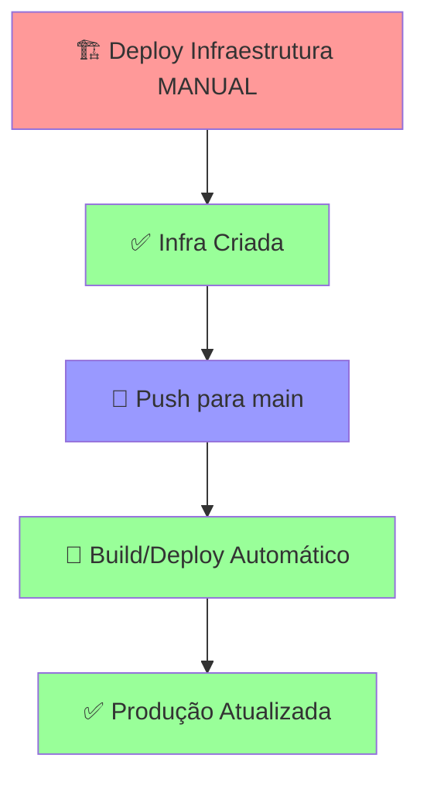

# 🚨 Problema: Pipeline de Produção Falha - Infraestrutura Não Encontrada

## 📋 Diagnóstico

A pipeline de build de produção (`build-prod.yml`) está falhando porque:

```
❌ Infraestrutura não encontrada
```

### 🔍 Causa Raiz
A pipeline de produção está tentando verificar se o cluster GCP `prod-cluster` existe, mas:
1. **A infraestrutura de produção ainda não foi criada**
2. A pipeline de build é **automática** (dispara em push para `main`)
3. Mas a infraestrutura deve ser criada **manualmente** primeiro

## 🎯 Solução: Execute as Pipelines na Ordem Correta

### 1️⃣ **PRIMEIRO**: Criar Infraestrutura de Produção (Manual)

1. Vá em **GitHub Actions**
2. Selecione **"MANUAL Deploy Infrastructure to Production"**
3. Clique em **"Run workflow"**
4. **Digite "CONFIRMO"** no campo de confirmação
5. **Escolha "production"** no ambiente
6. Clique em **"Run workflow"**

### 2️⃣ **DEPOIS**: A Pipeline de Build Funcionará Automaticamente

Após a infraestrutura ser criada, pushes para `main` funcionarão automaticamente.

## 🔧 Configuração de Secrets Necessários

Verifique se estes secrets estão configurados no GitHub:

### Para GCP (Produção):
```yaml
GCP_CREDENTIALS: "{ ... }"  # Service Account JSON completo
GCP_PROJECT_ID: "seu-project-id"  # ID do projeto GCP
DB_PASSWORD: "senha-do-banco"  # Se usar banco gerenciado
```

### Como verificar/configurar:
1. Vá em **Settings** → **Secrets and variables** → **Actions**
2. Verifique se os secrets acima existem
3. Se não existirem, clique em **"New repository secret"**

## 🚀 Fluxo Correto de Deploy



## 🔍 Como Verificar se a Infraestrutura Existe

Após executar a pipeline de infraestrutura, você pode verificar:

```bash
# Instalar gcloud CLI se necessário
# curl https://sdk.cloud.google.com | bash

# Autenticar
gcloud auth login

# Verificar clusters
gcloud container clusters list --project=SEU_PROJECT_ID

# Verificar se o cluster prod-cluster existe
gcloud container clusters describe prod-cluster --zone=us-central1-a --project=SEU_PROJECT_ID
```

## 🛠️ Se Continuar Falhando

1. **Verificar logs da pipeline de infraestrutura**
2. **Confirmar que todos os secrets estão corretos**
3. **Verificar permissões do Service Account GCP**
4. **Verificar se o projeto GCP está ativo**

## 📋 Checklist de Verificação

- [ ] Secrets do GCP configurados no GitHub
- [ ] Pipeline de infraestrutura executada com sucesso
- [ ] Cluster `prod-cluster` criado no GCP
- [ ] Service Account tem permissões necessárias
- [ ] Projeto GCP está ativo e com billing habilitado

## 🎯 Próximos Passos

1. **Execute a pipeline de infraestrutura MANUAL primeiro**
2. **Aguarde ela completar com sucesso**
3. **Depois faça push para main novamente**

A pipeline de build deveria funcionar automaticamente após a infraestrutura estar criada! 🚀
